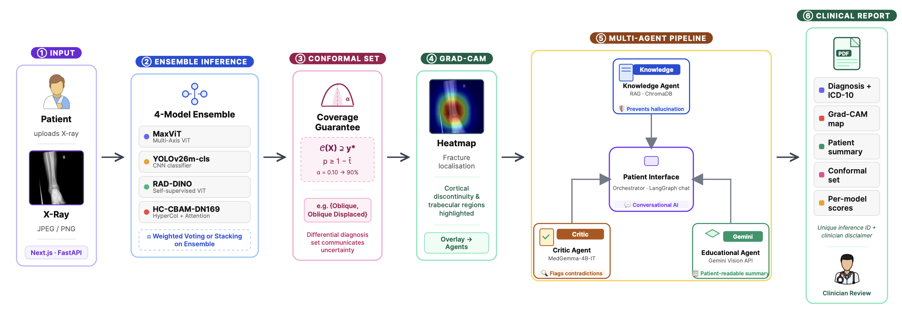

# FRAC-MAS: Multi-Agent Clinical Decision Support System

<p align="center">
  
  
  
  
  
  
</p>

<p align="center">
  <a href="https://cvpr-submission-frac-mas.vercel.app"><strong>Live Demo</strong></a> ·
  <a href="https://cvpr-submission-frac-mas.vercel.app/rubric"><strong>Clinician Evaluation Rubric</strong></a> ·
  <a href="outputs/reports/diagnosis_report.pdf"><strong>Technical Report</strong></a>
</p>

A modular medical imaging AI system for bone fracture detection combining a **4-model stacked ensemble**, **Grad-CAM explainability**, **RAG-grounded clinical context**, a **VLM-based Critic Agent**, and **conformal prediction** to produce human-verifiable orthopedic diagnoses.

---

## Overview

Frac-MAS is designed to assist healthcare professionals and patients in understanding bone fractures from X-ray images while maintaining the clinician as the final decision-maker. The system decomposes the diagnostic pipeline into four specialized agents — each independently verifiable — and routes every case through a LangGraph-orchestrated workflow that enforces evidence grounding and blind verification before any output reaches the user.

### Key Highlights

- **89.3%** ensemble argmax accuracy on HBFMID-derived 8-class test set
- **96.4%** fracture detection rate (stacking) on the Roboflow external dataset
- **94.6%** confirmed-cohort accuracy after Critic Agent triage
- **4-Model Core Ensemble** — MaxViT, HyperColumn-CBAM DenseNet-169, RAD-DINO, YOLOv26m-cls
- **Two-pass Weighted Soft Voting + Stacking** meta-learner for disambiguation
- **Conformal Prediction** — 92.0% empirical coverage at α = 0.10 with average set size 1.07
- **Grad-CAM Explainability** per model, with complementary spatial attention analysis
- **4-Agent LangGraph Workflow** — Patient Interface, Knowledge, Critic, and Educational agents
- **RAG Knowledge Base** backed by ChromaDB and `gemini-2.5-flash-lite`
- **MedGemma Critic** — blind two-step VLM verification with automatic triage
- **PDF Report Generation** using ReportLab, with per-inference ID and disclaimer
- **Next.js 16 / React 19 Web Interface** deployed on Vercel
- **FastAPI Backend** deployable on Hugging Face Spaces (Docker)
- **Clinician-Validated** — 4.14/5 technical accuracy, 3.95/5 comprehensibility (3 orthopedic surgeons)

---

## Links

| Resource                    | URL                                                                                                                                                    |
| --------------------------- | ------------------------------------------------------------------------------------------------------------------------------------------------------ |
| Live Website                | [cvpr-submission-frac-mas.vercel.app](https://cvpr-submission-frac-mas.vercel.app)                                                                       |
| Code Repository             | [github.com/anonymous-submission-research/CVPR-Submission-2026-FRAC-MAS](https://github.com/anonymous-submission-research/CVPR-Submission-2026-FRAC-MAS) |
| Clinician Evaluation Rubric | [cvpr-submission-frac-mas.vercel.app/rubric](https://cvpr-submission-frac-mas.vercel.app/rubric)                                                         |
| Technical Report PDF        | [`outputs/reports/diagnosis_report.pdf`](outputs/reports/diagnosis_report.pdf)                                                                         |

## System Architecture

The end-to-end pipeline integrates ensemble inference, Grad-CAM localization, multi-agent reasoning, and conformal prediction for verifiable clinical report generation.

<p align="center">
  
</p>

### Multi-Agent Workflow (LangGraph)

Every X-ray inference follows a four-agent LangGraph workflow with explicit handoffs and no output reaching the patient unless the Critic Agent has either confirmed or triaged the case:

```
X-Ray Upload
     │
     ▼
┌─────────────────────────────────┐
│  Ensemble Inference             │  MaxViT + HC-CBAM + RAD-DINO + YOLO
│  + Conformal Prediction Set     │  Distribution-free coverage guarantee
└──────────────┬──────────────────┘
               │
               ▼
┌─────────────────────────────────┐
│  Knowledge Agent                │  ChromaDB RAG → gemini-2.5-flash-lite
│  ICD-10, AO/OTA, Radiopaedia    │  Hallucination-free grounding
└──────────────┬──────────────────┘
               │
               ▼
┌─────────────────────────────────┐
│  Critic Agent (MedGemma VLM)    │  Blind diagnosis → verdict → triage
│  Two-step blind verification    │  Routes uncertain cases for human review
└──────────────┬──────────────────┘
               │
        ┌──────┴──────┐
        ▼             ▼
   Confirmed      Uncertain
        │        (Human Review)
        ▼
┌─────────────────────────────────┐
│  Educational Agent              │  Grad-CAM + gemini-2.5-pro
│  Patient-facing lay summary     │  Severity + next-steps guidance
└──────────────┬──────────────────┘
               │
               ▼
┌─────────────────────────────────┐
│  PDF Report Generator           │  ReportLab, unique inference ID
│  + Patient Interface Agent      │  LangGraph chat (gemini-2.5-flash-lite)
└─────────────────────────────────┘
```

### Agent Descriptions

| Agent                       | Purpose                                                                                                                         | Key Technology                                                                |
| --------------------------- | ------------------------------------------------------------------------------------------------------------------------------- | ----------------------------------------------------------------------------- |
| **Patient Interface Agent** | Entry point & router; personalises responses and orchestrates downstream agents                                                 | LangGraph, `gemini-2.5-flash-lite`                                            |
| **Knowledge Agent**         | Grounds all explanations in verified clinical sources (ICD-10, AO/OTA, Radiopaedia, FDA AI/ML)                                  | ChromaDB, sentence-transformers (`all-MiniLM-L6-v2`), `gemini-2.5-flash-lite` |
| **Critic Agent**            | Blind two-step VLM verification; produces independent top-diagnosis then evaluates ensemble verdict; triggers human-review flag | MedGemma-4B-IT via HF Spaces or local                                         |
| **Educational Agent**       | Generates lay summary with severity grading and next-steps plan; falls back to template-based NLG when API unavailable          | `gemini-2.5-pro`, Grad-CAM overlay                                            |

---

## Fracture Classification

The system classifies X-ray images into **8 categories**:

| Class                    | ICD-10 | Description                                                   | Severity        |
| ------------------------ | ------ | ------------------------------------------------------------- | --------------- |
| **Healthy**              | —      | No fracture detected                                          | None            |
| **Greenstick**           | S52    | Incomplete fracture; bone bends but does not break completely | Mild            |
| **Transverse**           | S52    | Straight break perpendicular to the bone axis                 | Moderate        |
| **Oblique**              | S52    | Angled break across the bone                                  | Moderate        |
| **Transverse Displaced** | S52    | Straight break with bone fragments shifted                    | Moderate–Severe |
| **Oblique Displaced**    | S52    | Angled break with bone fragments shifted                      | Moderate–Severe |
| **Spiral**               | S52    | Twisting fracture spiraling around the bone                   | Moderate–Severe |
| **Comminuted**           | S52    | Bone shattered into 3+ fragments                              | Severe          |

---

## Model Architectures

### Core Ensemble (CVPR 2026 Paper)

The paper ensemble consists of 4 models fine-tuned on the augmented HBFMID dataset and combined via two-pass weighted soft voting (or stacking):

| Model                          | Architecture                      | Params | Specialty                                                                  |
| ------------------------------ | --------------------------------- | ------ | -------------------------------------------------------------------------- |
| `hypercolumn_cbam_densenet169` | DenseNet-169 + Hypercolumn + CBAM | ~20M   | Multi-scale edge + structural context; priority for confused classes       |
| `maxvit`                       | MaxViT-Tiny                       | ~31M   | Multi-axis global attention; strongest standalone accuracy (96.2%)         |
| `rad_dino`                     | RAD-DINO (Microsoft)              | ~86M   | Self-supervised radiological pre-training; domain-specific representations |
| `yolo`                         | YOLOv26m-cls                      | ~26M   | CNN inductive bias; fast complementary feature extraction                  |

**Predictions are combined via two-pass weighted soft voting.** An equal-weighted first pass determines the preliminary class; if the result falls among commonly confused categories (Oblique, Oblique Displaced, Transverse, Transverse Displaced) a second pass elevates the HyperColumn-CBAM weight to leverage its multi-scale features for disambiguation. A **stacking meta-learner** (StandardScaler + LogisticRegression, trained with GridSearchCV) provides an alternative combination strategy.

### Additional Trained Models (Available in `models/`)

Beyond the 4-model paper ensemble, the repository includes checkpoints for the following additional models used in ablation studies and experiments:

| Checkpoint                                    | Architecture                      | Accuracy | F1 Macro |
| --------------------------------------------- | --------------------------------- | -------- | -------- |
| `best_maxvit.pth`                             | MaxViT-Tiny                       | 96.2%    | 96.6%    |
| `best_hypercolumn_cbam_densenet169.pth`       | HC-CBAM DenseNet-169              | 93.4%    | 93.6%    |
| `best.pt` (YOLO)                              | YOLOv26m-cls                      | 93.1%    | 93.8%    |
| `best_rad_dino_classifier.pth`                | RAD-DINO                          | 92.5%    | 93.1%    |
| `best_swin.pth`                               | Swin Transformer Small            | 92.5%    | 93.1%    |
| `best_mobilenetv2.pth`                        | MobileNetV2                       | 91.5%    | 91.8%    |
| `best_efficientnetv2.pth`                     | EfficientNet-B0                   | 90.6%    | 91.3%    |
| `best_densenet169.pth`                        | DenseNet-169                      | 89.6%    | 90.5%    |
| `best_hypercolumn_cbam_densenet169_focal.pth` | HC-CBAM DenseNet-169 + Focal loss | —        | —        |

### Custom HyperColumn-CBAM Architecture

```
Input Image (224×224×3)
         │
         ▼
┌─────────────────────────────────────┐
│     DenseNet169 Backbone            │
│  ┌─────────┬─────────┬─────────┐   │
│  │ Block 1 │ Block 2 │ Block 3 │   │
│  │  128ch  │  256ch  │  640ch  │   │
│  └────┬────┴────┬────┴────┬────┘   │
│       │         │         │        │
│       └─────────┴─────────┴────────┼──▶ Hypercolumn Fusion (2688ch)
│                                    │              │
│              Block 4 (1664ch) ─────┘              ▼
└─────────────────────────────────────┐    1×1 Conv (1024ch)
                                      │              │
                                      │              ▼
                                      │    ┌─────────────────┐
                                      │    │  CBAM Attention │
                                      │    │ Channel + Space │
                                      │    └────────┬────────┘
                                      │             │
                                      │             ▼
                                      │    Global Avg Pool
                                      │             │
                                      │             ▼
                                      │    FC (1024 → 8 classes)
                                      └─────────────────────────
```

---

## Results

### Single-Model Ablation (8-class held-out test set)

| Model                | Accuracy  | F1 Macro  |
| -------------------- | --------- | --------- |
| **MaxViT**           | **96.2%** | **96.6%** |
| HC-CBAM DenseNet-169 | 93.4%     | 93.6%     |
| YOLOv26m-cls         | 93.1%     | 93.8%     |
| RAD-DINO             | 92.5%     | 93.1%     |

All four backbones exceed 92% accuracy. Removing any one reduces ensemble performance, validating the diverse-architecture design.

### Ensemble & Conformal Prediction (HBFMID test set, n = 112)

| Metric                                | Value                          |
| ------------------------------------- | ------------------------------ |
| Ensemble argmax accuracy              | **89.3%**                      |
| Conformal coverage at α = 0.10        | **92.0%**                      |
| Conformal coverage at α = 0.05        | 90.2%                          |
| Average conformal set size (α = 0.10) | **1.07**                       |
| Singleton predictions                 | 92.9% (104 / 112)              |
| Error recovery by conformal sets      | 25% (3 of 12 errors recovered) |

Calibration thresholds: $\hat{t}_{0.05} = 0.718$, $\hat{t}_{0.10} = 0.529$.

### External Validation

**Roboflow Bone Break Classification (140 images, all fracture-positive):**

| Configuration           | Detection Rate | F1        |
| ----------------------- | -------------- | --------- |
| Ensemble (Weighted Avg) | 92.9%          | 96.3%     |
| **Ensemble (Stacking)** | **96.4%**      | **98.2%** |
| MaxViT (single)         | 95.0%          | 97.4%     |

The stacking ensemble correctly identifies all 6 fracture types unseen during training (Avulsion, Hairline, Longitudinal, Impacted, Pathological, Fracture Dislocation).

**FracAtlas (200 balanced images — full musculoskeletal body):** Best AUC = 0.652; best accuracy under Youden's J = 64.3%. The modest AUC reflects domain shift from hand/wrist X-rays (training) to femoral neck and vertebral radiographs.

### Critic Agent (n = 112)

| Metric                                  | Value          |
| --------------------------------------- | -------------- |
| Raw ensemble accuracy                   | 89.3%          |
| Confirmed-cohort accuracy (post-Critic) | **94.6%**      |
| Safety margin                           | +5.3 pp        |
| Confirmed / total                       | 92 / 112 (82%) |
| Uncertain (routed for human review)     | 20 / 112 (18%) |

### Grad-CAM Attention Analysis

| Fracture          | MaxViT Active (%) | HC-CBAM Active (%) |
| ----------------- | ----------------- | ------------------ |
| Comminuted        | 2.4%              | 59.8%              |
| Oblique Displaced | 7.4%              | 53.0%              |
| Spiral            | 7.4%              | 66.8%              |
| Transverse        | 20.6%             | 58.5%              |

MaxViT isolates fracture lines; HyperColumn-CBAM captures structural context. The 6×–25× spatial coverage difference explains the complementarity and ensemble gain.

### Human Validation (3 Orthopedic Surgeons)

| Dimension          | Mean Score (1–5) | Score ≥ 4 (%) | Fleiss' κ                   |
| ------------------ | ---------------- | ------------- | --------------------------- |
| Technical Accuracy | **4.14**         | 75.0%         | 0.72 (substantial)          |
| Comprehensibility  | **3.95**         | 68.2%         | 0.65 (moderate–substantial) |

---

## Project Structure

```
CVPR-Submission-2026-FRAC-MAS/
│
├──  website/                          # Next.js 16 + React 19 web interface (Vercel)
│   ├──  src/app/                      # App Router pages (diagnose/, rubric/, api/)
│   ├──  src/components/              # Reusable UI components (Shadcn, Radix, Recharts)
│   ├──  package.json                 # Next.js, Tailwind CSS, framer-motion, chart.js
│   ├──  fracmas_diagnosis_report.pdf   # Comprehensive technical report
│   └──  README.md
│
├──  backend_hf/                       # FastAPI backend (Hugging Face Spaces / Docker)
│   ├──  app.py                        # FastAPI app: /diagnose, /chat, /report endpoints
│   ├──  fracmas_agent_module.py         # Self-contained MedGemma Critic + consensus logic
│   ├──  patient_agent_graph.py        # LangGraph-based Patient Interface Agent workflow
│   ├──  report_generator.py           # ReportLab multi-page PDF report generator
│   ├──  shared.py                     # Shared state (IMAGE_STORE, CLASS_NAMES)
│   └──  requirements.txt
│
├──  src/
│   └──  fracmas/
│       ├──  app.py                    # Streamlit application (local use / experimentation)
│       ├──  agents/                   # Modular agent implementations
│       │   ├── diagnostic_agent.py      # Single-model inference
│       │   ├── educational_agent.py     # Patient-friendly language generation
│       │   ├── explain_agent.py         # Grad-CAM heatmap generation & overlay
│       │   ├── critic_agent.py          # VLM-based blind verification & triage
│       │   ├── knowledge_agent.py       # ChromaDB RAG retrieval
│       │   ├── medgemma_client.py       # MedGemma VLM client (HF Spaces / local)
│       │   ├── cross_validation_agent.py
│       │   └── patient_agent.py
│       ├──  modules/                  # Shared utilities and model loading
│       ├──  uncertainty/              # Conformal prediction utilities
│       ├──  training/                 # Training pipeline
│       ├──  analysis/                 # Data analysis tools
│       └──  utils/
│
├──  scripts/
│   ├──  calibration/
│   │   ├── prepare_val_and_calibrate.py # Build val NPZ, grid-search HC weight, calibrate conformal
│   │   ├── calibrate_conformal.py       # Standalone conformal threshold calibrator
│   │   ├── analyze_conformal.py         # Conformal set analysis & coverage plots
│   │   └── compute_validation_metrics.py# Confusion matrix, per-class Brier scores, plots
│   ├──  evaluation/
│   │   ├── evaluate.py                  # General evaluation script
│   │   ├── evaluate_binary_balanced_augmented.py
│   │   ├── evaluate_ensemble_stacking.py
│   │   ├── evaluate_fracatlas.py        # FracAtlas external validation
│   │   ├── evaluate_roboflow.py         # Roboflow external validation
│   │   ├── evaluate_critic.py           # Critic Agent evaluation on test set
│   │   └── evaluate_fracmas_mamba.py
│   ├──  inference/
│   │   ├── inspect_images.py            # Per-image per-model logits + Grad-CAM export
│   │   └── run_xfmamba_inference.py
│   ├──  training/
│   │   ├── train_stacker.py             # Stacking meta-classifier (StandardScaler + GridSearchCV)
│   │   ├── train_stacker_combo2_3models_v2.py
│   │   ├── train_dinorad.py             # RAD-DINO fine-tuning
│   │   ├── train_rad_dino.py
│   │   ├── train_yolo_cls.py            # YOLOv26 classification fine-tuning
│   │   ├── train_vssm_base.py
│   │   ├── train_xfmamba_fast.py
│   │   └── vssm.py
│   └──  visualization/
│       ├── visualize_gradcam.py         # Generate Grad-CAM visualizations
│       ├── gradcam_comparison_grid.py   # Multi-model Grad-CAM comparison grids
│       ├── visualize_xgradcam.py
│       └── additional_viz.py
│
├──  data/
│   ├──  balanced_augmented_dataset/   # HBFMID-derived 8-class balanced splits
│   ├──  bone_break_classification/    # Roboflow external validation dataset
│   ├──  fracatlas/                    # FracAtlas external validation dataset
│   └──  roboflow_dataset/
│
├──  balanced_augmented_dataset/       # Root-level split CSVs (train/val/test.csv)
│
├──  chroma_db/                        # ChromaDB persistent vector database
│
├──  outputs/
│   ├── val_calib.npz                    # Validation per-model probabilities + ground-truth labels
│   ├── critic_evaluation.json           # Critic Agent evaluation results (n=112)
│   ├──  conformal/                    # Conformal prediction results
│   ├──  ensemble/                     # Ensemble evaluation outputs
│   ├──  evaluation/                   # General evaluation results
│   ├──  fracatlas_eval/               # FracAtlas evaluation outputs
│   ├──  roboflow_eval/                # Roboflow evaluation outputs
│   ├──  balanced_augmented_binary_eval/
│   ├──  gradcam_results/              # Grad-CAM heatmap outputs
│   ├──  figures/                      # Paper figures and plots
│   ├──  inference_logs/
│   ├──  reports/                      # Generated PDF reports
│   └──  analysis/
│
├──  notebooks/                        # Jupyter notebooks
│   ├── evaluate_models.ipynb
│   ├── train_dinorad.ipynb
│   ├── train_xfmamba.ipynb
│   ├──  eda/
│   ├──  experiments/
│   └──  training/
│
├──  diagrams/
│   └── architecture-diagram.png         # System architecture figure
│
├──  tests/
│   ├──  unit/
│   └──  integration/
│
├──  app.py                            # Root-level Streamlit entry point
├──  requirements.txt                  # Python dependencies
├──  LICENSE                           # MIT License
└──  README.md
```

---

## Installation

### Prerequisites

- Python 3.11+
- CUDA 11.8+ or Apple Silicon MPS (optional, for GPU acceleration)
- Google AI Studio API key (for Gemini models used in Knowledge and Educational Agents)
- HuggingFace token with access to `google/medgemma-4b-it` (for Critic Agent)

### Backend Setup (Python)

```bash
# Clone the repository
git clone https://github.com/anonymous-submission-research/CVPR-Submission-2026-FRAC-MAS.git
cd CVPR-Submission-2026-FRAC-MAS

# Create virtual environment
python -m venv venv
source venv/bin/activate  # On Windows: venv\Scripts\activate

# Install dependencies
pip install -r requirements.txt
```

### API Keys

Copy `.env.example` to `.env` (or set environment variables directly):

```bash
# Google Gemini (Knowledge Agent: gemini-2.5-flash-lite, Educational Agent: gemini-2.5-pro)
GOOGLE_API_KEY=your-google-ai-studio-key

# HuggingFace (Critic Agent — MedGemma-4B-IT)
HF_TOKEN=your-huggingface-token
MEDGEMMA_MODE=hf_spaces           # or "local" for on-device inference
MEDGEMMA_SPACES_URL=https://...   # your MedGemma HF Spaces URL

# ChromaDB path (defaults to ./chroma_db)
CHROMA_DB_PATH=./chroma_db
```

### Website Setup (Next.js)

```bash
cd website
npm install
```

Create `website/.env.local`:

```env
BACKEND_URL=https://your-hf-space-url
```

```bash
npm run dev   # http://localhost:3000
```

---

## Usage

### Running the FastAPI Backend Locally

```bash
cd backend_hf
python app.py
# Server starts at http://localhost:7860
```

Key endpoints:

- `POST /diagnose` — Upload an X-ray image; returns ensemble prediction, per-model confidence, Grad-CAM overlays, conformal set, Critic verdict, and educational summary.
- `POST /chat` — Patient chat via the LangGraph Patient Interface Agent.
- `POST /report` — Generate and download a multi-page PDF diagnostic report.

### Running the Streamlit App (Local / Experimentation)

```bash
streamlit run src/fracmas/app.py
# Opens at http://localhost:8501
```

### Application Workflow

1. **Upload X-Ray** — JPG or PNG bone radiograph
2. **Ensemble Inference** — 4 models produce per-class probabilities
3. **Conformal Prediction Set** — True class included with ≥ 90% coverage guarantee
4. **Knowledge Grounding** — RAG retrieves ICD-10 code, severity, treatment guidelines
5. **Critic Verification** — MedGemma performs blind two-step audit; routes uncertain cases for human review
6. **Educational Summary** — Grad-CAM overlay + Gemini-generated lay description with next-steps
7. **PDF Report** — Structured multi-page report with unique inference ID and disclaimer
8. **Patient Chat** — Follow-up questions answered by the LangGraph Patient Interface Agent

---

## Conformal Prediction

The system wraps ensemble outputs in a split-conformal prediction set with a distribution-free coverage guarantee. Nonconformity scores are $s = 1 - p_{\text{true}}$. Given miscoverage level $\alpha$, the threshold $\hat{t}$ is the $\lceil(1-\alpha)(n+1)\rceil / n$ quantile of calibration scores. At inference, every class with $p_i \geq 1 - \hat{t}$ enters the prediction set.

```bash
# Calibrate conformal threshold on validation set
python scripts/calibration/prepare_val_and_calibrate.py --checkpoint-dir models --alpha 0.10
# Writes: outputs/val_calib.npz  and  conformal_threshold.txt (~0.529 for α=0.10)

# Standalone calibration from a saved NPZ
python scripts/calibration/calibrate_conformal.py --input outputs/val_calib.npz --alpha 0.10
```

**Calibrated thresholds**: $\hat{t}_{0.05} = 0.718$, $\hat{t}_{0.10} = 0.529$

---

## Stacking Meta-Classifier

```bash
# Train the stacking meta-classifier
python scripts/training/train_stacker.py \
    --input outputs/val_calib.npz \
    --out outputs/stacker.joblib
# Writes: outputs/stacker.joblib and outputs/stacker_eval.json
```

The stacker pipeline: `StandardScaler → LogisticRegression(multi_class='multinomial')` with `GridSearchCV` over L2 regularization strength `C`. The stacking ensemble achieves **96.4% detection rate** on the Roboflow external validation set vs. 92.9% for weighted averaging.

---

## Grad-CAM Explainability

Grad-CAM is generated per model and shown side-by-side on the website's Explainability panel. Toggle individual models to compare spatial attention.

**Key finding:** MaxViT attends to 2%–21% of the image (focal fracture-line localization) while HyperColumn-CBAM attends to 53%–67% (broad structural context). This complementarity drives the ensemble gain.

```bash
# Generate Grad-CAM for all models
python scripts/visualization/visualize_gradcam.py

# Multi-model comparison grid (used in paper figures)
python scripts/visualization/gradcam_comparison_grid.py

# Per-image per-model logits + Grad-CAM export for inspection
python scripts/inference/inspect_images.py
```

---

## Key Artifacts (`outputs/`)

| Artifact                         | Description                                                   |
| -------------------------------- | ------------------------------------------------------------- |
| `outputs/val_calib.npz`          | Validation per-model probabilities + ground-truth labels      |
| `outputs/critic_evaluation.json` | Critic Agent evaluation on 112-sample test set                |
| `outputs/stacker.joblib`         | Trained stacking pipeline (scaler + logistic regression)      |
| `outputs/stacker_eval.json`      | Stacker validation accuracy and best GridSearch parameters    |
| `outputs/conformal/`             | Conformal set results and coverage plots                      |
| `outputs/fracatlas_eval/`        | FracAtlas external validation outputs and ROC curves          |
| `outputs/roboflow_eval/`         | Roboflow external validation outputs                          |
| `outputs/gradcam_results/`       | Per-image per-model Grad-CAM heatmaps                         |
| `outputs/figures/`               | Paper figures (per-class coverage, ROC curves, Grad-CAM grid) |

---

## Dataset & Training

**HBFMID (Human Bone Fracture Multi-modal Image Dataset)** — augmented, balanced to 8 classes.

| Parameter           | Value                      |
| ------------------- | -------------------------- |
| Image Size          | 224×224                    |
| Batch Size          | 32                         |
| Optimizer           | AdamW                      |
| Learning Rate       | 1e-4 (cosine annealing)    |
| Epochs              | 50                         |
| Loss Function       | CrossEntropy / Focal Loss  |
| Device              | MPS (Apple Silicon) / CUDA |
| Experiment Tracking | Weights & Biases           |

---

## Knowledge Base

The Knowledge Agent queries a curated ChromaDB vector store containing ICD-10 codes, AO/OTA classification references, Radiopaedia clinical entries, FDA AI/ML guidelines, treatment protocols, severity ratings, and recovery prognosis for all 8 fracture classes.

```python
# ChromaDB semantic search with sentence-transformer embeddings
chroma_client = chromadb.PersistentClient(path="./chroma_db")
embedding_fn = SentenceTransformerEmbeddingFunction(model_name="all-MiniLM-L6-v2")
collection = chroma_client.get_or_create_collection("medical_diagnoses")
```

---

## API Reference (FastAPI Backend)

### `POST /diagnose`

Upload a bone X-ray to receive a full diagnostic response.

**Form Fields:** `file` (UploadFile), `enable_conformal` (bool), `stacker_path` (str), `threshold_file` (str)

**Response:**

```json
{
  "inference_id": "uuid",
  "predicted_class": "Oblique",
  "confidence": 0.87,
  "conformal_set": ["Oblique", "Oblique Displaced"],
  "individual_predictions": { "maxvit": {}, "yolo": {} },
  "gradcam_overlays": { "maxvit": "base64..." },
  "critic_verdict": "yes",
  "critic_flagged": false,
  "knowledge_summary": { "icd10": "S52.2", "severity": "Moderate" },
  "educational_summary": "..."
}
```

### `POST /chat`

Send a follow-up patient question. **Form Fields:** `inference_id`, `message`, `user_context` (optional JSON).

### `POST /report`

Generate and return a multi-page PDF diagnostic report for a given `inference_id`.

---

## Website & Deployment

### Website (`website/`)

Built with **Next.js 16**, **React 19**, **Tailwind CSS**, **Shadcn UI**, and **Radix UI**. Key libraries: `framer-motion` (animations), `recharts` / `chart.js` (result visualizations), `react-markdown` (Markdown rendering).

Pages: `/` (landing), `/diagnose` (inference UI with per-model Grad-CAM toggle), `/rubric` (evaluation form).

```bash
cd website && npm run build && npm start
```

Deployed on **Vercel** at [cvpr-submission-frac-mas.vercel.app](https://cvpr-submission-frac-mas.vercel.app).

### Backend (`backend_hf/`)

FastAPI application deployed on **Hugging Face Spaces** (Docker SDK). The backend loads model checkpoints (tracked via Git LFS), initialises ChromaDB, and exposes the `/diagnose`, `/chat`, and `/report` endpoints.

---

## Configuration

### Environment Variables

| Variable              | Description                               | Default             |
| --------------------- | ----------------------------------------- | ------------------- |
| `GOOGLE_API_KEY`      | Google AI Studio key for Gemini models    | Required for agents |
| `HF_TOKEN`            | HuggingFace token for MedGemma access     | Required for Critic |
| `MEDGEMMA_MODE`       | `hf_spaces` (API) or `local` (on-device)  | `hf_spaces`         |
| `MEDGEMMA_SPACES_URL` | HF Spaces endpoint URL for MedGemma       | —                   |
| `CHROMA_DB_PATH`      | ChromaDB storage path                     | `./chroma_db`       |
| `BACKEND_URL`         | FastAPI backend URL (for Next.js website) | —                   |

### Model Checkpoints

Place model `.pth` / `.pt` files under `models/` with the naming convention `best_{model_name}.pth`. The backend auto-discovers checkpoints at startup.

---

## Contributing

1. Fork the repository
2. Create a feature branch (`git checkout -b feature/amazing-feature`)
3. Commit changes (`git commit -m 'Add amazing feature'`)
4. Push to branch (`git push origin feature/amazing-feature`)
5. Open a Pull Request

---

## License

This project is licensed under the MIT License — see the [LICENSE](LICENSE) file for details.

---

## Acknowledgments

- **HBFMID** — Human Bone Fracture Multi-modal Image Dataset (Parvin et al., 2024)
- **RAD-DINO** — Microsoft's radiology-specific self-supervised vision backbone
- **MaxViT** — Multi-axis vision transformer (Tu et al., 2022)
- **YOLOv26** — Sapkota et al., 2025
- **timm** — PyTorch Image Models
- **pytorch-grad-cam** — Grad-CAM and variant implementations
- **ChromaDB** — Embedding-based vector database
- **LangGraph** — Multi-agent workflow orchestration
- **Gemini 2.5** — Google DeepMind generative models (`gemini-2.5-flash-lite`, `gemini-2.5-pro`)
- **MedGemma** — Google's medical vision-language model
- **ReportLab** — PDF generation
- **Vercel** — Frontend hosting

---

## Disclaimer

This system is intended for **research and educational purposes only**. It should **NOT** be used as a substitute for professional medical diagnosis. Always consult a qualified healthcare provider for medical advice. Each generated report carries a unique inference ID and an explicit disclaimer to this effect.

---

<p align="center">
  Made with ❤️ for advancing accessible medical AI
</p>
